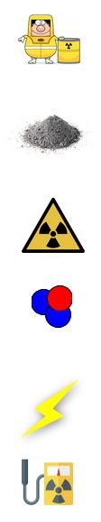
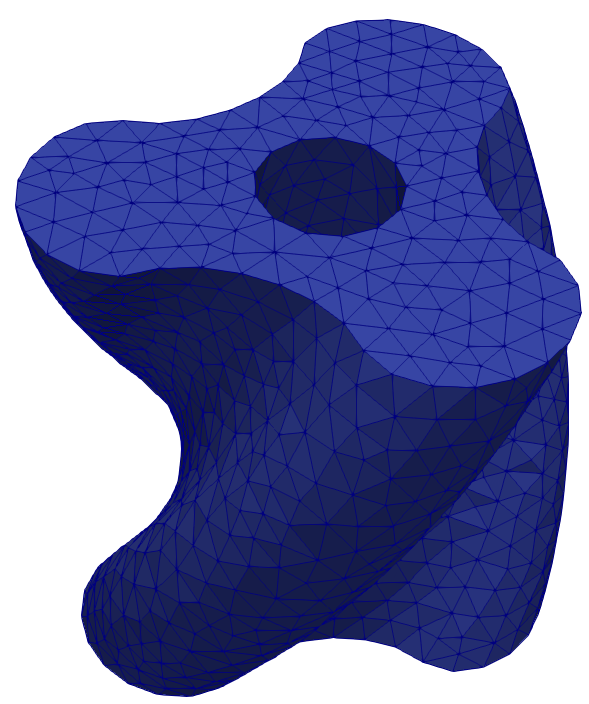
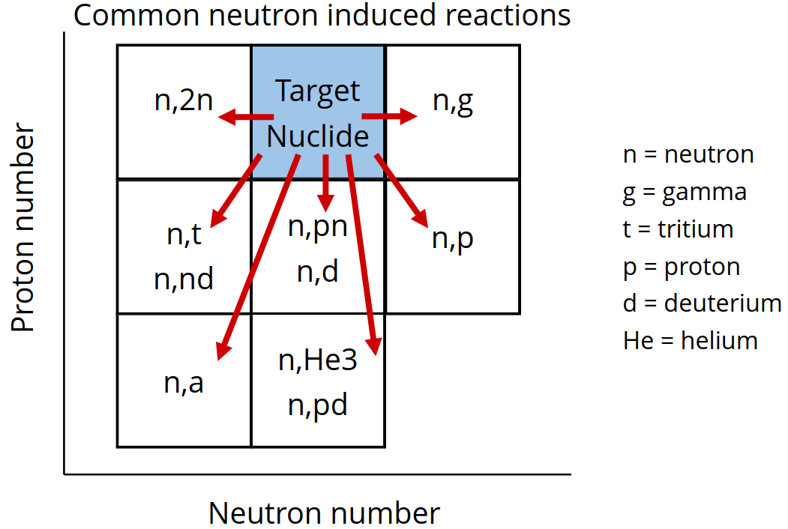
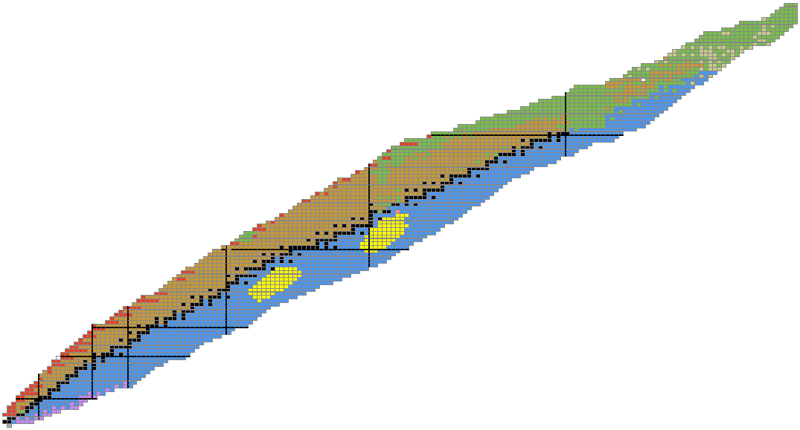

<style>
  :root {
    --color-background: #fff;
    --color-foreground: #333;
    --color-highlight: #f96;
    --color-dimmed: #888;
    font-family: 'Century Gothic';
    color: #3466C2
  }
  {
    font-size: 29px
  }
  code {
    white-space : pre-wrap !important;
    word-break: break-word;
  }
  .columns {
    display: grid;
  }
  h1 {
    justify-content: center;
  }
  section {
    justify-content: start;
  }
  img[alt~="bottom-right"] {
    position: absolute;
    top: 90%;
    right: 1%;
  }
</style>


# Fusion Neutronics Workshop


<!--  -->

---


# Why is neutronics useful



- **Radioactivity** - Neutrons activate material, making it radioactive leading to handling and waste storage requirements.​
- **Hazardous** - Neutrons are Hazardous to health and shielded will be needed to protect the workforce.​
- ***Produce fuel*** - Neutrons will be needed to convert lithium into tritium to fuel the reactor.​
- ***Electricity*** - 80% of the energy release by each DT reaction is transferred to the neutron.​
- ***Structural integrity*** - Neutrons cause damage to materials such as embrittlement, swelling, change conductivity …​
- ***Diagnose*** - Neutrons are an important method of measuring a variety of plasma parameters (e.g. Q value).​

---

# Topics Covered Half Day Course

- Neutron and Photon interaction cross sections

- Material creation

- Particle sources

- Constructive Solid Geometry (CSG)

- Tallies (heat, tritium breeding ratio, damage, flux)

- Neutron activation

---

# Getting started

- 🐋 Install Docker

- 🔽 Download the docker image

- 🏃Run the docker image

- 🔗 Navigate to the URL in the terminal

Detailed instructions are on [<u>GitHub</u>](https://github.com/fusion-energy/neutronics-workshop/tree/main#local-installation)


---

# Containers

<div class="columns"  style="font-size: 30px;">
<div>

Install single package (Docker) and avoid installing a few hundred packages.

- Portable
- Reproducible
- Security
- Isolation
- Deployable

</div>
<div>


image source xkcd.com
</div>
<div>

---

# Tasks

<div class="columns"  style="font-size: 30px;">
<div>

- Collection of Jupyter notebooks

- Separate task folder for each topic

- Learning outcomes for each task

- Simulation outputs include:
  - numbers
  - graphs
  - images
  - 3D visualization.
</div>
<div>


</div>
<div>

---

# OpenMC

<div class="columns">
<div>

- Increasing adoption in fusion
- [Supportive community](https://openmc.discourse.group/)
- [GitHub repository](https://github.com/openmc-dev/openmc/)
- Permissive license (MIT)
- Python API, C++ backend
- [Scales to 100,000+ cores](https://doi.org/10.1016/j.anucene.2014.07.048)
- CPU and GPU version
- [Online documentation](https://docs.openmc.org/en/stable/)
- [Excellent fusion specific workshops](https://github.com/fusion-energy/neutronics-workshop)
</div>
<div>

<!-- [](https://star-history.com/#openmc-dev/openmc&Date) -->
[](https://star-history.com/#openmc-dev/openmc&Date)

</div>
<div>

---


# Getting started

<div class="columns"  style="font-size: 30px;">
<div>

1. Run the docker image
    ```docker run -p 8888:8888 ghcr.io/fusion-energy/neutronics-workshop```

2. Double click on the ```half-day-workshop``` folder circled in red.

</div>
<div>


</div>
<div>

---


# Timetable

<div class="columns"  style="font-size: 20px;">
<div>

- 9.00 Introduction presentation
- 9.10 Plotting cross sections
    - task_01_isotope_xs_plot
    - task_02_element_xs_plot
    - task_03_material_xs_plot
- 9.40 Making materials
    - task_04_example_materials_from_isotopes
    - task_05_example_materials_from_elements
- 9.55 Geometry
    - task_06_simple_csg_geometry
- 10.15 Break
- 10.30 Plotting particles
  - task_07_point_source_plots
  - task_08_ring_source
  - task_09_plasma_source_plots

</div>
<div>

- 11.05 Tritium Breeding Ratio (TBR)
  - task_10_example_tritium_production
- 11.15 Damage (DPA)
  - task_11_find_dpa
- 11:30 Break
- 11:45 neutron photon spectra
  - task_12_example_neutron_spectra_on_cell  
  - task_13_example_photon_spectra
- 12.15 mesh tallies
  - task_14_example_2d_regular_mesh_tallies
- 12.30 activation
  - task_15_full_pulse_schedule
- 12.45 Putting it all together
  - task_16_optimal_design

</div>
</div>

---

# Microscopic Cross Sections

- Probability of interaction is characterised by the microscopic cross-section (σ). It is the effective size of the nucleus.

- Cross section data is key to the neutronics workflow and provide us with the likelihood of a particular interaction.

- Cross sections can be measured experimentally with monoenergetic neutrons.

---

# Experimental data

<div class="columns"  style="font-size: 30px;">
<div>

Availability of experimental data varies for different reactions and different isotopes.

Typically the experimental data is then interpreted to create evaluation libraries, such as ENDF, JEFF, JENDL, CENDL.


</div>
<div>

[](https://nds.iaea.org/dataexplorer/)

Source [IAEA nuclear data services](https://nds.iaea.org/dataexplorer/?target_elem=Au&target_mass=197&reaction=n%2Cg)

</div>
<div>

---

# Cross section reactions

Cross section evaluations exist for:

- different nuclides
- different interactions.

A list of reactions available in OpenMC is [<u>here</u>](https://docs.openmc.org/en/stable/usersguide/tallies.html#id2)

For example:
- Be9(n,2n)2He would be a neutron interaction with beryllium 9 which results in 2 neutrons and 2 helium nuclei.
- Li6(n,Xt) would be a neutron interaction with lithium 6 nuclei which results in a tritium and X is a wildcard.

---

# Reaction rate

- The reaction rate ($RR$) can be found by knowing the number of neutrons per unit volume ($n$), the velocity of neutrons ($v$), the material density ($p$), Avogadro's number ($N_{a}$), the microscopic cross section at the neutron energy ($\sigma_{e}$) and the atomic weight of the material ($M$).
- This reduces down to the neutron flux ($\phi$), nuclide number density ($N_{d}$) and microscopic cross section\sigma_{e}.
- This can be reduced one more stage by making use of the Macroscopic cross section ($\Sigma_{e}$).


$$ RR = \frac{nv\rho N_{a}\sigma_{e} }{M} = \phi N_{d} \sigma_{e} = \phi \Sigma_{e} $$

---

# Now complete tasks 1, 2 and 3 in the half day workshop

---

# Making materials

<div class="columns"  style="font-size: 30px;">
<div>

Neutronics codes require the isotopes and the number density.

This can be provided with different combinations of density units, isotope/element concentration and weight or atom fractions.

</div>
<div>


</div>
<div>

---


# Making materials - nuclides

Simple material construction from nuclides.

```python
mat2 = openmc.Material()
mat2.add_nuclide('Li6', 0.0759*2)
mat2.add_nuclide('Li7', 0.9241*2)
mat2.add_nuclide('O16', 0.9976206)
mat2.add_nuclide('O17', 0.000379)
mat2.add_nuclide('O18', 0.0020004)
mat2.set_density('g/cm3', 2.01)
```

---


# Making materials - elements

Simpler material construction from elements.

```python
import openmc

mat1 = openmc.Material()
mat1.add_element('H', 2)
mat1.add_element('O', 1)
mat1.set_density('g/cm3', 2.01)
```

---


# Making materials - enrichment

Simple enriched material construction from elements.

```python
import openmc

mat1 = openmc.Material()
mat1.add_element('Li', 4, enrichment_target='Li6', enrichment=60)
mat1.add_element('Si', 1)
mat1.add_element('O', 4)
mat1.set_density('g/cm3', 2.01)
```

---

# Now complete tasks 4 and 5 in the half day workshop

---

# Making Geometry

<div class="columns">
<div style="width: 150%;">

The simplest geometry is a single surface and a cell defined as below (-) that surface.

```python
import openmc

surface_sphere = openmc.Sphere(r=10.0)
region_inside_sphere = -surface_sphere
cell_sphere = openmc.Cell(region=region_inside_sphere) 

cell_sphere.fill = steel
```

</div>
<div style="display: flex; justify-content: flex-end">


</div>
<div>

---

# Making Geometry


<div class="columns">
<div style="width: 150%;">


Cells can also be constrained by multiple surfaces. This example is above (+) one surface and (&) below (-) another

```python
import openmc

surf_sphere1 = openmc.Sphere(r=10.0)
surf_sphere2 = openmc.Sphere(r=20.0)
between_spheres = +surf_sphere1 & -surf_sphere2
cell_between = openmc.Cell(region= between_spheres) 

cell_sphere.fill = steel
```

</div>
<div style="display: flex; justify-content: flex-end">


</div>
<div>


---

# Edge of the model


<div class="columns">
<div style="width: 150%;">


The outer most surface of the model should have a ```boundary_type``` set to ```"vacuum"``` to indicate that neutrons should not be tracked beyond this surface.
```python
import openmc 

surf_sphere = openmc.Sphere(r=10.0, boundary_type="vacuum")
between_spheres = -surf_sphere
cell_between = openmc.Cell(region= between_spheres) 
```


</div>
<div style="display: flex; justify-content: flex-end">


</div>
<div>

---


# Surfaces available

<div class="columns">
<div>


Constructive Solid Geometry (CSG) [<u>implementation in OpenMC</u>](https://docs.openmc.org/en/stable/usersguide/geometry.html#id2) has the following surface types.

- **XPlane**, YPlane, ZPlane, Plane
- XCylinder, YCylinder, **ZCylinder**
- **Sphere**
- XCone, YCone, ZCone,
- Quadric
- XTorus, YTorus, ZTorus

</div>
<div>


Image source [<u>Paramak</u>](https://paramak.readthedocs.io/en/main/)
</div>
<div>

---

# More complex geometry

OpenMC also supports:

- boolean operations like union, intersection and complement.
- rotations and translations
- nested geometry with universes
- different surface types (e.g reflective for sector model)

For more complex 3D geometry [<u>DAGMC</u>](https://github.com/svalinn/DAGMC) can be used which makes use of a meshed geometry to transport particles.




---

# Now complete task 6 in the half day workshop

---

# Plotting particles

<div class="columns">
<div>


Neutron and photon sources have distributions for:
- space
- energy
- direction

Visualization of the source term helps check the simulation is correct


</div>
<div>


</div>
<div>

---

# Spatial distribution of MCF and ICF sources

The spatial distribution of MCF plasma covers a larger area compared to ICF' 

<div class="columns">
<div >

<div style="width: 60%;">

</div>

</div>
<div>

.

</div>
<div>

---

# Energy distribution MCF and ICF sources


<div class="columns">
<div >


The energy distribution of MCF has less neutron scattering compared to ICF. Neutrons are:
- up scattered through collisions with alpha particles
- down scattered through collisions with DT nuclides
- plot shows initial neutron energy from a 50:50 DT plasma

</div>
<div>


</div>
<div>

---

# Now complete tasks 7, 8 and 9 in the half day workshop

---

# Tritium Breeding Ratio

<iframe src="https://prezi.com/embed/rnzt6pjj-xfu/?bgcolor=ffffff&lock_to_path=0&autoplay=1&autohide_ctrls=1&landing_data=bHVZZmNaNDBIWnNjdEVENDRhZDFNZGNIUE43MHdLNWpsdFJLb2ZHanI0eWk1QlBaUER3dVArS1hRQTAxNXdDZWNRPT0&landing_sign=ABm-Z3JCWCuKHnLF1Q-0yjuTsqyWAQdv3CEpUjcYcXk" title="W3Schools Free Online Web Tutorials" width="100%" height="100%"></iframe>


---

# Now complete task 10 in the half day workshop

---

# Damage tallies


---

# Now complete task 11 in the half day workshop

---


# Neutron scattering

<div class="columns">
<div >


- (n,n)
- Neutron collides with the nucleus
- Neutron scatters of the nucleus losing energy
- Energy gained by the nucleus which recoils

[<u>image source slb.com</u>](https://glossary.slb.com/en/terms/e/elastic_neutron_scattering)

</div>
<div>


- (n,n'g)
- Neutron capture by the nucleus
- Instantaneously re-emitted with less energy
- Nucleus in excited state
- Relaxes to ground state by emitting gamma rays

</div>
<div>


---

# Neutron scattering angle


<div class="columns">
<div >

- At low energies the angular distribution is often isotropic
- As the neutron energy increases the scattering typically becomes more forward peaked
- Resonances in the cross section can impact the angular distribution probabilities

</div>
<div>


Image source tend.web.psi.ch

</div>
<div>

---

# Path length

<div class="columns">
<div >

- Path length = 1 / $\Sigma_{T}$
- A 14MeV neutron will lose energy via scattering interactions
- As the neutron energy decreases the path length also decreases
- Path length at thermal energy is more constant


</div>
<div>


</div>
<div>


---

# Energy loss

The average logarithmic energy decrement (or loss) per collision ($\xi$) is related to the atomic mass ($A$) of the nucleus

<div style='text-align: center;'>

$\xi = 1+ \frac{(A-1)^2}{2A} ln \frac{(A-1)}{(A+1)}$

</div>

<table style="width:100%">
  <tr>
    <th></th>
    <th>Hydrogen</th>
    <th>Deuterium</th>
    <th>Beryllium</th>
    <th>Carbon</th>
    <th>Uranium</th>
  </tr>
  <tr>
    <td>Mass of nucleus</td>
    <td>1</td>
    <td>2</td>
    <td>9</td>
    <td>12</td>
    <td>238</td>
  </tr>
  <tr>
    <td>Energy decrement</td>
    <td>1</td>
    <td>0.7261</td>
    <td>0.2078</td>
    <td>0.1589</td>
    <td>0.0084</td>
  </tr>
</table>

---


# Collisions to thermalize

The average number of collisions required to reduce the energy of the neutron from $E_{0}$ to $E$.

<div style='text-align: center;'>

$n = \frac{1}{\xi} (ln E_0 - ln E)$

</div>

If $E_{0}$ is 14MeV and $E$ is 0.025eV

<table style="width:100%">
  <tr>
    <th></th>
    <th>Hydrogen</th>
    <th>Deuterium</th>
    <th>Beryllium</th>
    <th>Carbon</th>
    <th>Uranium</th>
  </tr>
  <tr>
    <td>Number of collisions to thermalize</td>
    <td>20</td>
    <td>25</td>
    <td>85</td>
    <td>115</td>
    <td>2172</td>
  </tr>
</table>

---

# Moderating power

We should account for the likelihood of scattering.

The number density of the nucleus (ND) and the microscopic cross section (σ) combine to produce the macroscopic scattering cross section (Σ)

<div style='text-align: center;'>

$\Sigma _s = N_D \sigma_s$

$Moderating \; power = \xi \Sigma _s$

</div>

<table style="width:100%">
  <tr>
    <th></th>
    <th>Hydrogen</th>
    <th>Deuterium</th>
    <th>Beryllium</th>
    <th>Carbon</th>
    <th>Polyethylene</th>
  </tr>
  <tr>
    <td>Moderating power</td>
    <td>1.28</td>
    <td>0.18</td>
    <td>0.16</td>
    <td>0.064</td>
    <td>3.26</td>
  </tr>
</table>

---

# Now complete tasks 12 and 13 in the half day workshop

---

# Mesh tallies

<div class="columns">
<div >

- A grid of voxels / mesh elements can be overlaid on a geometry and the neutron response can be tallied in each voxel.

- The mesh is typically 3D and defined with a top right and lower left coordinate.

</div>
<div>


</div>
<div>

---

# Mesh tallies


<div class="columns">
<div >

- For our example we have a grid of voxels with only 1 voxel in one direction.
- This allows a pixel image of the tally result to be easily plotted.

</div>
<div>


</div>
<div>


---

# Mesh tallies geometry


<div class="columns">
<div >

- The geometry makes use of a two spheres and a plane surface type.
- The materials in each region respond very differently to neutrons
- The task has mesh tallies with different scores and plotting to visualize the result

</div>
<div>


</div>
<div>

---
# Now complete task 14 in the half day workshop

---

# Activation reactions



---

# Activation pathways


---
# Activation products


<div class="columns">
<div>

- High energy neutron activation


</div>
<div>

- Low energy neutron activation


</div>
<div>

---


# Activation products from fission

- Fission of large atoms (e.g. U235)
- Results in two fission products far from stability



---

# Build up and saturation

<div class="columns">
<div>

<span style="color:green;">

- New isotopes created during irradiation

</span>

<span style="color:orange;">

- Radioactive isotopes decay and will eventually reach a point where decay rate is equal to activation rate.

</span>

<span style="color:red;">

- Decay is more noticeable once the plasma is shutdown.

</span>

- The activity is related to the irradiation time and the nuclide half life.

</div>
<div>


</div>
<div>


---

# Now complete task 15 in the half day workshop

---

# Summary task

Replace the "```your code here```" sections to make the best reactor.

Chose the best options from a selection of materials.

Refine the design to:
- maximize Tritium Breeding Ratio (TBR)
- maximize blanket heating
- minimize damage to the conductor

---

# Now complete task 16 in the half day workshop
